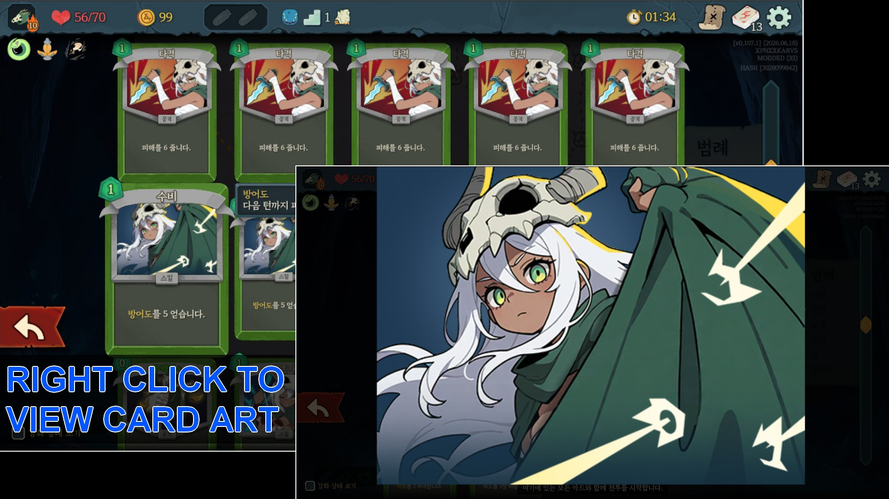

## 개요 (Overview)

> 백과사전, 덱, 카드 상세 보기 등 카드를 우클릭하여 카드 아트를 전체화면으로 볼 수 있는 Slay the Spire 2 모드입니다.  카드 아트가 열린 상태에서 다시 우클릭을 하거나 ESC 키를 눌러 닫을 수 있습니다.

> A Slay the Spire 2 mod that allows you to view card art in fullscreen by right-clicking a card in the Compendium, Deck or Card Inspection  While the card art is displayed, you can close it by right-clicking again or pressing the ESC key.

 

## 설치 (Installation)

 

**스팀 창작마당**

- https://steamcommunity.com/sharedfiles/filedetails/?id=3751384083

 

**메뉴얼 설치**

1. Release 에서 모드 압축 파일을 다운로드 합니다.
2. 게임 설치 경로 ("Steam\steamapps\common\Slay the Spire 2") 으로 이동 합니다.
3. 압축 해제한 모드의 폴더 (`CardArtFullscreenViewer`)를 게임 설치 경로 안의 `mods` 폴더에 추가합니다. (폴더가 없을 경우 생성)

 

**Steam Workshop**

- https://steamcommunity.com/sharedfiles/filedetails/?id=3751384083

 

**Manual Installation**

1. Download the mod archive file from the Releases page.
2. Navigate to your game installation directory ("Steam\steamapps\common\Slay the Spire 2").
3. Move the extracted mod folder (`CardArtFullscreenViewer`) into the `mods` folder inside the game installation directory. (Create the `mods` folder if it does not exist.)

 

## 모드 컨픽 (Mod Config)
> [ModConfig](https://steamcommunity.com/sharedfiles/filedetails/?id=3747557003) 모드를 통해 설정을 변경할 수 있습니다. 카드 보상, 강화 등에서 우클릭으로 상세 보기가 나오지 않는 것이 불편한 경우 `덱, 보상 화면, 백과사전에서 사용`을 비활성화 해주세요.

> You can change the settings via [ModConfig](https://steamcommunity.com/sharedfiles/filedetails/?id=3747557003) mod. If you feeling inconvenient because of card inspection not showing up by right-clicking on card rewards or enchanment, disable the setting `Enable on Decks, Rewards and Compendium`.

 

## 의존성 - 개발자 전용 (Dependencies - Developers Only)
> 일반 사용자는 이 항목을 읽지 않아도 됩니다. 프로젝트를 수정하고 싶은 개발자를 위해 작성된 내용입니다.  의존성 dll을 프로젝트 루트 디렉토리 (`.csproj` 파일이 있는 위치) 에 `lib` 폴더를 생성하고 해당 디렉토리에 추가합니다.

 

**의존성 목록:**

- sts2.dll
- GodotSharp.dll

 

> Regular users can safely skip this section. This information is intended for developers who wish to modify the project.  Create a `lib` folder in the project root directory (where the `.csproj` file is located) and add the dependency DLLs to that directory.

 

**Dependency List:**

- sts2.dll
- GodotSharp.dll
